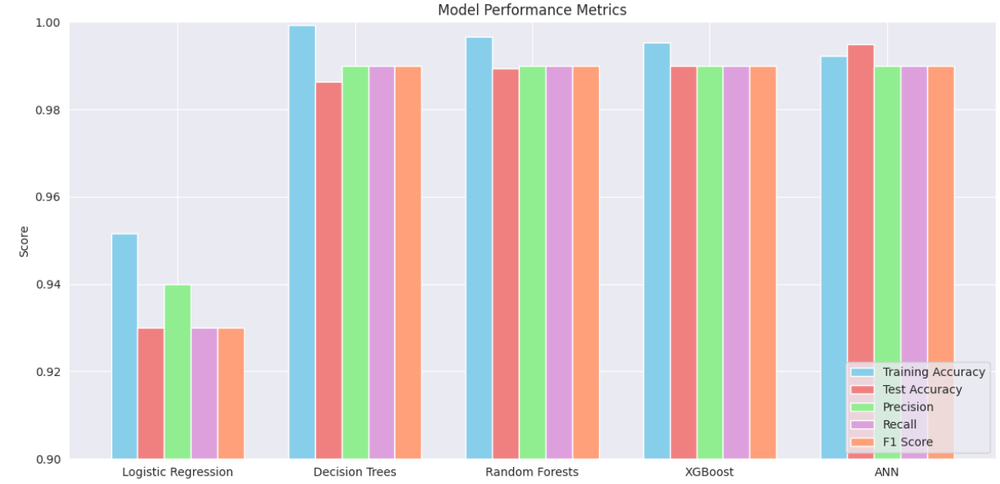

## 📚 Loan Default Prediction Using Machine Learning Algorithms: A Comparative Study

Predicting loan defaults is crucial for financial institutions to mitigate risk and enhance decision-making. The report compares five machine learning algorithms—**Logistic Regression**, **Decision Trees**, **Random Forest**, **XGBoost**, and **Artificial Neural Networks (ANN)**—to predict loan default risk.

Key data preprocessing steps include **feature engineering**, **label encoding**, and **hyperparameter tuning** using `RandomizedSearchCV`. Model performance was evaluated using **accuracy**, **precision**, **recall**, **F1 score**, and **AUC**. Among all models, **Random Forest**, **XGBoost**, and **ANN** outperformed Logistic Regression and Decision Trees across all metrics. The results are also compared with existing studies, highlighting the importance of model selection and optimization in predictive finance.

---

## 📌 Objectives

1. Apply multiple machine learning algorithms to predict loan default.
2. Compare performance using various evaluation metrics.
3. Enhance model performance through hyperparameter tuning.
4. Benchmark results against prior research in this domain.

---

## 🧠 Machine Learning Models Used

- Logistic Regression
- Decision Trees
- Random Forest
- XGBoost
- Artificial Neural Network (ANN)

---

## 🗃️ Dataset Overview

- **Source**: [Kaggle Dataset](#) *(Link to be added)*
- **Shape**: 148,670 rows × 34 columns  
- **Target Variable**: `Status` (binary: Defaulted or Repaid)

---

## 🛠️ Methodology

### 1. Exploratory Data Analysis (EDA)
- Investigated data distribution and relationships
- Handled missing values and outliers
- Visualized key insights:
  - **Correlation matrix**
  - **Loan status distribution**
  - **Feature importance**

### 2. Data Preprocessing
- Dropped non-predictive features like `ID`
- Encoded categorical variables using **Label Encoding**
- Handled missing values:
  - Numerical → Median imputation
  - Categorical → Mode imputation
- Outliers handled using **IQR-based capping**

### 3. Feature Engineering & Selection
- Used **Random Forest feature importance** and correlation analysis
- Selected top 10 features for modeling

### 4. Train/Test Split
- **80/20 split**
- Random state set to **42** for reproducibility

### 5. Feature Scaling
- Used **StandardScaler** for normalization (especially beneficial for Logistic Regression)

### 6. Hyperparameter Optimization
- Performed using `RandomizedSearchCV` for tuning key model parameters

---

## 📈 Evaluation Metrics

Models were evaluated using the following metrics:

- **Accuracy**
- **Precision**
- **Recall**
- **F1 Score**
- **ROC AUC Score**

---

## 🏆 Results Summary

| Model               | Training Accuracy | Test Accuracy | Precision | Recall | F1 Score |
|--------------------|-------------------|---------------|-----------|--------|----------|
| Logistic Regression| 0.9515            | 0.9300        | 0.94      | 0.93   | 0.93     |
| Decision Trees     | 0.9993            | 0.9864        | 0.99      | 0.99   | 0.99     |
| Random Forests     | 0.9967            | 0.9893        | 0.99      | 0.99   | 0.99     |
| XGBoost            | 0.9952            | 0.9899        | 0.99      | 0.99   | 0.99     |
| ANN                | 0.9923            | 0.9949        | 0.99      | 0.99   | 0.99     |

---

## 📊 Visual Results

Key comparisons are visualized using the following plots located in the `images/` folder:

- **Bar chart** comparing Accuracy, Precision, Recall, and F1 Score for all models
- **ROC Curves** comparing classifier performance
- **Confusion Matrices** for detailed prediction analysis

### 📷 Visualizations:

---
